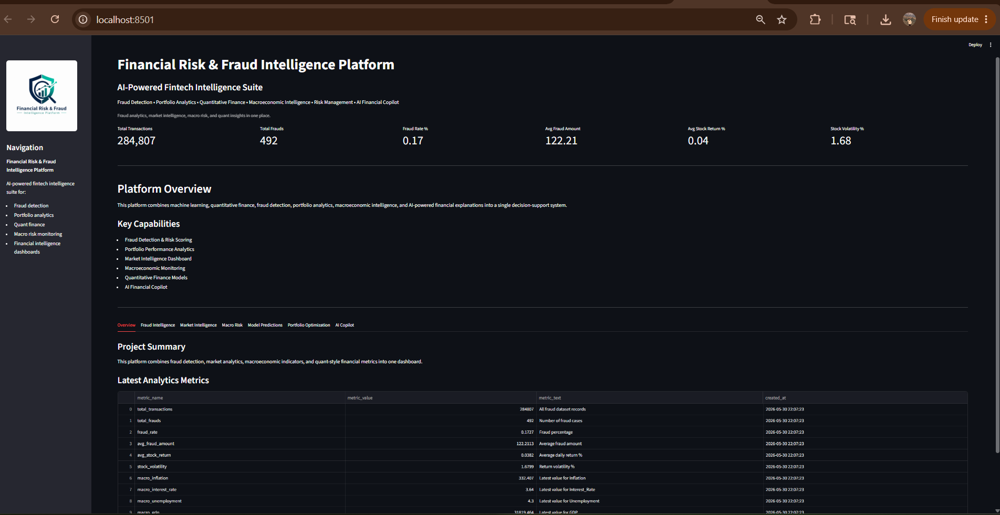
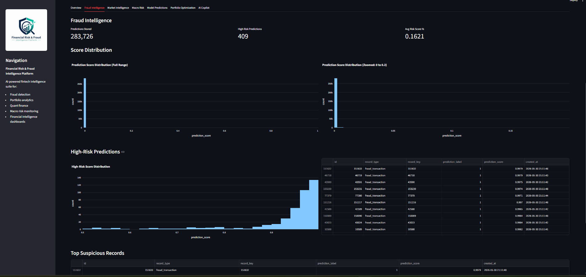
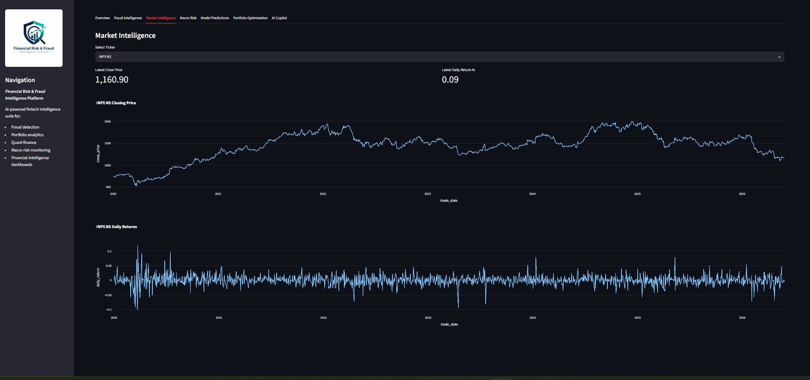
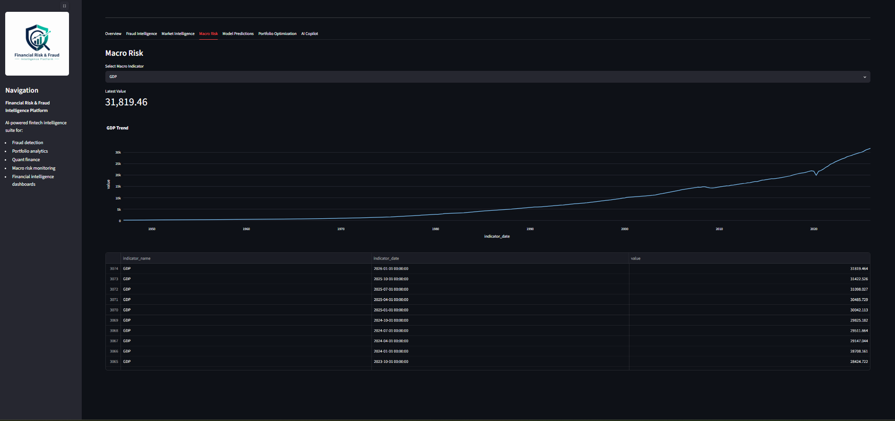
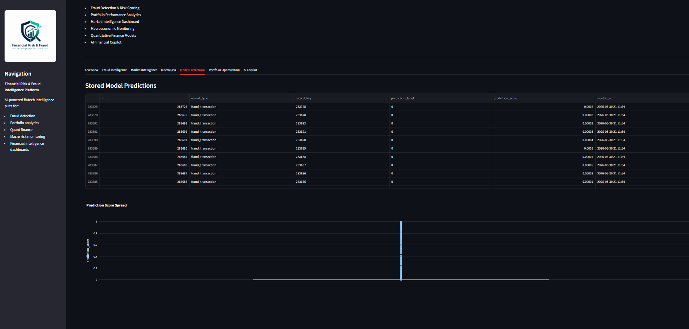
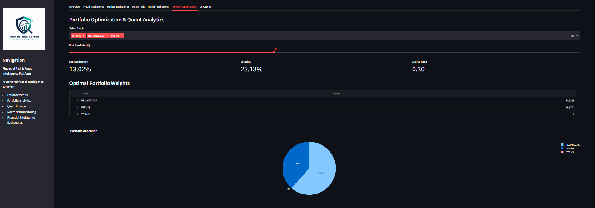
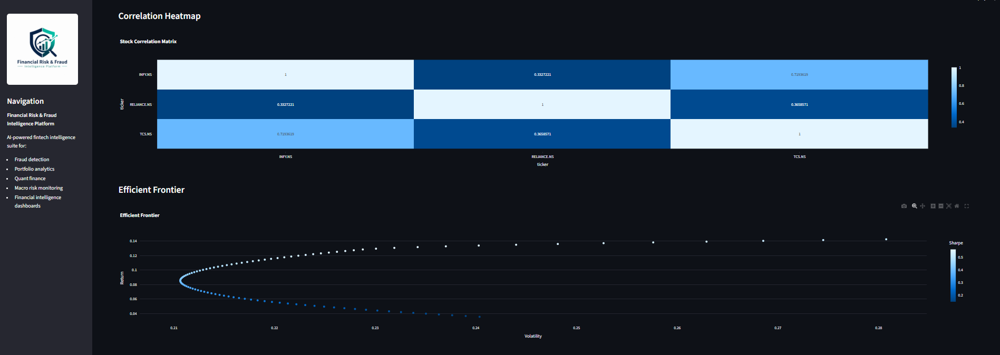
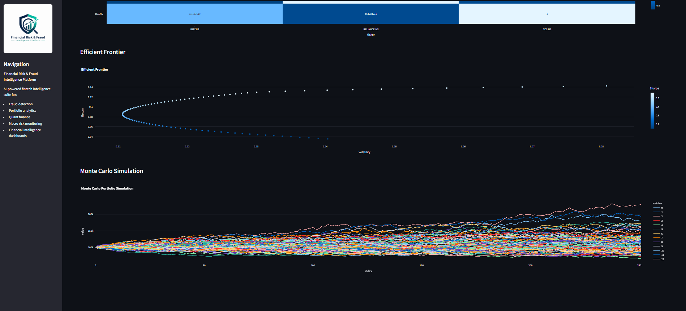
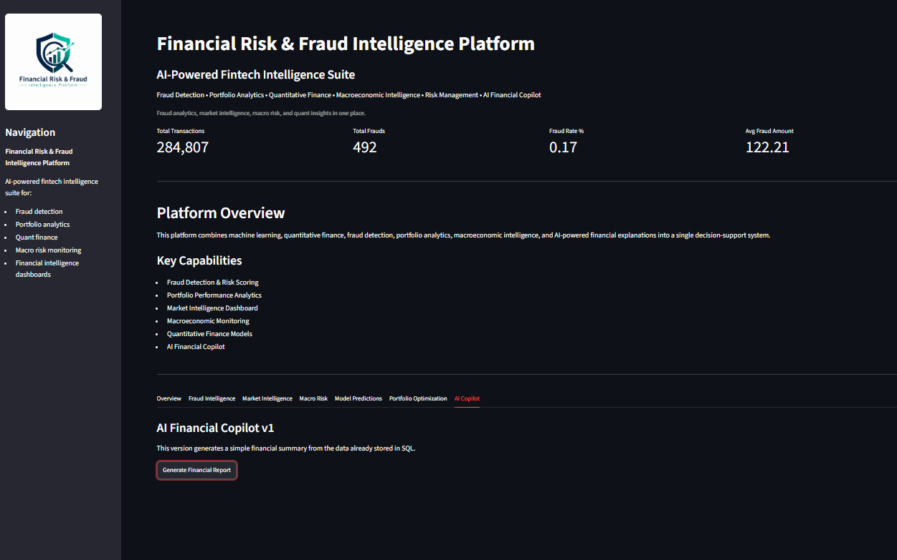
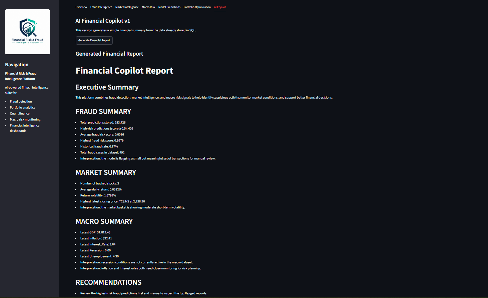

# Financial Risk & Fraud Intelligence Platform

## Overview

The Financial Risk & Fraud Intelligence Platform is an end-to-end fintech analytics solution designed to help investors and financial institutions make better decisions using data, machine learning, quantitative finance, and AI-powered insights.

The platform addresses two major challenges in modern finance:

1. Helping investors understand and manage portfolio risk.
2. Detecting potentially fraudulent financial transactions.

By combining fraud detection, portfolio optimization, macroeconomic monitoring, quantitative finance models, and AI-generated financial insights into a single platform, this project demonstrates how modern fintech systems leverage data to improve decision-making and risk management.

---

## Problem Statement

Retail investors are increasingly participating in financial markets but often lack access to professional-grade risk analytics tools.

At the same time, fintech companies process millions of transactions every day and face growing challenges in identifying fraudulent activities before financial losses occur.

This project aims to bridge that gap by providing:

* Financial risk monitoring
* Fraud detection and risk scoring
* Portfolio optimization
* Quantitative finance analytics
* AI-powered financial explanations
* Interactive business dashboards

---

## Dashboard Preview

### Platform Overview

Provides a consolidated view of fraud metrics, market intelligence indicators, macroeconomic signals, and quantitative finance analytics.



---

### Fraud Intelligence Dashboard

Machine learning–powered fraud detection with risk scoring, suspicious transaction identification, prediction distributions, and high-risk transaction monitoring.



---

### Market Intelligence Dashboard

Interactive stock market analytics featuring historical price trends, daily return analysis, and performance tracking.



---

### Macroeconomic Risk Monitoring

Tracks GDP, inflation, interest rates, unemployment, recession indicators, and other macroeconomic variables.



---

### Model Predictions Repository

Stores and visualizes machine learning prediction outputs used for fraud detection and risk assessment.



---

### Portfolio Optimization & Quant Analytics

Modern Portfolio Theory (MPT) implementation featuring portfolio allocation, efficient frontier analysis, correlation heatmaps, and Monte Carlo simulations.

#### Portfolio Allocation



#### Correlation Heatmap & Efficient Frontier



#### Monte Carlo Simulation



---

### AI Financial Copilot

Generates automated executive-level financial reports using fraud analytics, market intelligence, and macroeconomic insights.

#### Copilot Interface



#### Generated Financial Report



---

## Key Features

### Fraud Intelligence

* Fraud transaction detection using Machine Learning
* Transaction risk scoring
* Fraud analytics dashboard
* High-risk transaction identification
* Fraud prediction storage and monitoring

### Portfolio Intelligence

* Portfolio optimization
* Efficient Frontier analysis
* Risk-return visualization
* Portfolio allocation recommendations
* Correlation analysis

### Quantitative Finance Models

* Time Value of Money (TVM)
* Capital Asset Pricing Model (CAPM)
* Sharpe Ratio
* Value at Risk (VaR)
* Portfolio Volatility Analysis
* Monte Carlo Simulation

### Market Intelligence

* Historical stock market analysis
* Performance tracking
* Daily return analysis
* Volatility monitoring

### Macroeconomic Intelligence

* GDP tracking
* Inflation monitoring
* Interest rate analysis
* Recession indicator monitoring
* Economic trend visualization

### AI Financial Copilot

The AI Financial Copilot converts complex analytics into business-friendly insights.

Capabilities include:

* Executive Summary Generation
* Fraud Risk Explanation
* Portfolio Risk Interpretation
* Macroeconomic Analysis
* Automated Financial Report Generation
* Actionable Recommendations

---

## Model Performance

### Fraud Detection Model

**Algorithm:** XGBoost Classifier

Performance on the fraud dataset:

* ROC-AUC Score: **0.976**
* Precision (Fraud Class): **0.97**
* Recall (Fraud Class): **0.75**
* F1 Score (Fraud Class): **0.85**

These results demonstrate strong fraud detection capability while maintaining a low false-positive rate.

---

## Technology Stack

### Programming & Analytics

* Python
* SQL
* Pandas
* NumPy
* Excel

### Machine Learning

* Scikit-Learn
* XGBoost

### Quantitative Finance

* Modern Portfolio Theory
* CAPM
* Sharpe Ratio
* Value at Risk (VaR)
* Monte Carlo Simulation

### Databases

* Microsoft SQL Server (MSSQL)

### Visualization & Dashboarding

* Streamlit
* Plotly

### Data Sources

* Yahoo Finance (yfinance)
* FRED API
* Financial Fraud Datasets

---

## Datasets & Data Sources

### Fraud Detection Dataset

Used for:

* Fraud transaction classification
* Risk scoring
* Model training and evaluation

### Yahoo Finance (yfinance)

Used for:

* Historical stock prices
* Market analytics
* Portfolio optimization

### FRED API

Used for macroeconomic indicators such as:

* GDP
* Inflation
* Interest Rates
* Recession Signals

---

## Project Architecture

```text
Financial Data Sources
        │
        ▼
 Data Ingestion Layer
        │
        ▼
 MSSQL Database
        │
        ▼
 Data Processing & Feature Engineering
        │
        ▼
 Machine Learning Models
        │
        ▼
 Quantitative Finance Engine
        │
        ▼
 AI Financial Copilot
        │
        ▼
 Streamlit Dashboard
```

---

## Dashboard Modules

### Overview

High-level platform metrics and system summary.

### Fraud Intelligence

Fraud scoring, risk monitoring, and suspicious transaction analysis.

### Market Intelligence

Historical stock analysis and market performance tracking.

### Macro Risk

Macroeconomic monitoring using FRED indicators.

### Portfolio Optimization

Portfolio construction, efficient frontier analysis, and Monte Carlo simulation.

### AI Financial Copilot

Automated financial insight generation and executive reporting.

---

## Installation

Clone the repository:

```bash
git clone <repository-url>
cd Financial-Risk-Fraud-Intelligence-Platform
```

Create and activate a virtual environment:

```bash
python -m venv .venv
.venv\Scripts\activate
```

Install dependencies:

```bash
pip install -r requirements.txt
```

---

## Running the Project

### Data Pipelines

```bash
python -m src.stock_ingestion
python -m src.data_ingestion
python -m src.macro_ingestion
```

### Machine Learning

```bash
python -m src.fraud_model
```

### Portfolio Optimization

```bash
python -m src.portfolio_optimization
```

### Launch Dashboard

```bash
streamlit run app/streamlit_app.py
```

---

## Learning Objectives

This project was built to gain hands-on experience in:

* Financial Engineering
* Quantitative Finance
* Data Analytics
* Machine Learning
* Business Intelligence
* FinTech Systems
* AI Applications in Finance

---

## Roadmap

### Version 1 (Current)

* Fraud Detection Engine
* Portfolio Optimization
* Quantitative Finance Models
* AI Financial Copilot
* Interactive Streamlit Dashboard

### Version 2

* Financial News Intelligence
* Credit Risk Scoring
* Power BI Dashboard
* AWS Deployment
* Snowflake Integration

### Version 3

* AI Copilot with Natural Language Analytics
* Retrieval-Augmented Generation (RAG)
* Advanced Financial Intelligence Workflows

---

## Author

**Piyush Kumawat**

B.Tech, General Engineering
Indian Institute of Technology (IIT) Mandi
